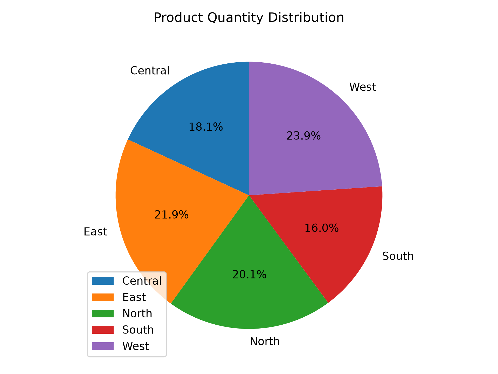

# 📊 Sales Data Analyzer

<div align="center">

## 🚀 Python-Based Sales Data Analysis & Visualization

**Explore • Clean • Analyze • Visualize • Save**

[](https://www.python.org/)
[](https://pandas.pydata.org/)
[](https://numpy.org/)
[](https://matplotlib.org/)
[](https://seaborn.pydata.org/)
[](https://jupyter.org/)

</div>

---

## 📖 About the Project

**Sales Data Analyzer** is a menu-driven Python project created to demonstrate a practical data-analysis workflow using **Pandas, NumPy, Matplotlib, and Seaborn**.

The application reads sales information from a CSV dataset and provides an interactive menu for loading, exploring, transforming, cleaning, statistically analyzing, visualizing, and saving results.

The main functionality is organized inside a reusable `SalesDataAnalyzer` class, making the project easy to understand for students who are learning Python and Data Science.

---

## 🎯 Project Objective

The project demonstrates how raw CSV data can be transformed into useful information through a complete basic analysis pipeline:

```text
CSV Dataset
     │
     ▼
Load Data
     │
     ▼
Explore Dataset
     │
     ▼
DataFrame / NumPy Operations
     │
     ▼
Handle Missing Values
     │
     ▼
Statistical Analysis
     │
     ▼
Create Visualizations
     │
     ▼
Save Chart
```

The goal is not only to calculate values, but also to understand how different Python data-analysis libraries work together.

---

# ✨ Key Features

| Feature | Description |
|---|---|
| 📂 Load Dataset | Import a CSV file into a Pandas DataFrame |
| 🔍 Explore Data | View rows, columns, data types, and basic information |
| 🔢 NumPy Operations | Convert numeric columns into NumPy arrays |
| ➕ Mathematical Operations | Addition, subtraction, multiplication, and division |
| 🔗 Combine DataFrames | Demonstrate DataFrame concatenation |
| ✂️ Filter Data | Select records using region-based filtering |
| 📊 Aggregation | Sum, mean, count, minimum, and maximum |
| 🧹 Missing Data | Detect, fill, drop, and replace missing values |
| 📈 Statistics | Describe, correlation, standard deviation, variance, percentiles |
| 📊 Visualization | Bar, line, scatter, pie, histogram, and additional plots |
| 💾 Save Visualization | Export the current chart as a high-resolution image |
| 🖥️ CLI Menu | Simple interactive menu-driven interface |

---

# 🖥️ Main Menu

```text
==================================================
Welcome to Sales Data Analyzer!
==================================================

== Main Menu ==

1. Load Dataset
2. Explore Data
3. Perform DataFrame Operations
4. Handle Missing Data
5. Generate Descriptive Statistics
6. Data Visualization
7. Save Visualization
8. Exit
```

---

# 📂 Dataset

The provided `sales_data.csv` dataset contains **500 rows and 9 columns**.

### Dataset Columns

| Column | Description |
|---|---|
| `Date` | Date of the transaction |
| `Customer_ID` | Customer identifier |
| `Gender` | Customer gender |
| `Age` | Customer age |
| `Region` | Sales region |
| `Product` | Product purchased |
| `Quantity` | Quantity purchased |
| `Sales` | Sales amount |
| `Profit` | Profit generated |

### Dataset Shape

```text
Rows    : 500
Columns : 9
```

### Regions

```text
South
West
Central
North
East
```

### Product Categories

The dataset contains products such as:

```text
Router
Camera
Webcam
Microphone
Tablet
Mouse
Keyboard
Laptop
Monitor
Printer
Graphics Card
Projector
Smart Watch
Hard Drive
Speaker
UPS
Scanner
SSD
Smartphone
Power Bank
```

---

# 🔍 1. Load Dataset

The `load_data()` method asks the user for the path of the CSV file.

```python
file_path = input("Enter the path of the dataset (CSV file) : ")
self.data = pd.read_csv(file_path)
```

If the file is successfully loaded:

```text
✅ Dataset loaded successfully!
```

If the file cannot be found:

```text
❌ File not found. Please try again.
```

---

# 🔎 2. Explore Data

The Explore Data section provides five options:

```text
1. Display first 5 rows
2. Display last 5 rows
3. Display column names
4. Display data type
5. Display basic info
```

### First Rows

```python
self.data.head()
```

### Last Rows

```python
self.data.tail()
```

### Column Names

```python
list(self.data.columns)
```

### Data Types

```python
self.data.dtypes
```

### Basic Information

```python
self.data.info()
```

This allows the user to understand the structure of the dataset before performing analysis.

---

# 🔢 3. DataFrame Operations

The DataFrame Operations section includes:

```text
1. NumPy Array Operations
2. Mathematical Operations
3. Combine DataFrames
4. Split Data
5. Aggregating Functions
```

---

## 🔢 NumPy Array Operations

A numeric DataFrame column can be converted into a NumPy array:

```python
arr = self.data[column].to_numpy()
```

The application displays:

- The complete array
- First element
- Last element

This demonstrates how Pandas and NumPy can work together.

---

# ➕ Mathematical Operations

The project performs element-wise numerical operations using NumPy.

```python
arr + 10
arr - 10
arr * 2
arr / 2
```

Available operations:

- Addition
- Subtraction
- Multiplication
- Division

This demonstrates NumPy's ability to perform operations on complete arrays efficiently.

---

# 🔗 Combine DataFrames

The project demonstrates DataFrame concatenation:

```python
df2 = self.data.head(2)
result = pd.concat([self.data, df2])
```

This provides a simple example of combining DataFrame objects.

---

# ✂️ Filter / Split Data

The project can select sales records based on a region:

```python
result = self.data[self.data["Region"] == region]
```

For example:

```text
South
West
North
East
Central
```

This is useful for region-wise analysis.

---

# 📊 Aggregating Functions

For a selected numeric column, the application calculates:

```text
Sum
Mean
Count
Minimum
Maximum
```

Implemented using:

```python
self.data[column].sum()
self.data[column].mean()
self.data[column].count()
self.data[column].min()
self.data[column].max()
```

These calculations provide a quick summary of numerical data.

---

# 🧹 4. Handle Missing Data

The project includes a dedicated module for handling missing values.

### Options

```text
1. Display rows with missing values
2. Fill missing value with mean
3. Drop rows with missing values
4. Replace missing value with a specific value
```

---

## 🔍 Detect Missing Values

The program checks:

```python
self.data.isnull().values.any()
```

It can display all rows containing missing values.

---

## 📌 Fill Missing Values with Mean

Numeric columns are identified with:

```python
numeric_cols = self.data.select_dtypes(include=np.number).columns
```

Then missing values can be filled with the mean:

```python
self.data[numeric_cols] = (
    self.data[numeric_cols]
    .fillna(self.data[numeric_cols].mean())
)
```

---

## 🗑️ Drop Missing Rows

Missing-value rows can be removed:

```python
self.data.dropna(inplace=True)
```

---

## 🔄 Replace Missing Values

The user can enter a specific replacement value:

```python
self.data.fillna(value, inplace=True)
```

---

# 📈 5. Statistical Analysis

The Statistical Analysis module contains:

```text
1. Display summary statistics
2. Display correlation matrix
3. Standard deviation
4. Variance
5. Percentiles
```

---

## 📋 Summary Statistics

The project uses:

```python
self.data.describe()
```

This provides:

- Count
- Mean
- Standard deviation
- Minimum
- 25th percentile
- 50th percentile
- 75th percentile
- Maximum

---

## 🔗 Correlation Matrix

The project calculates correlations between numeric columns:

```python
self.data.corr(numeric_only=True)
```

This can be used to investigate relationships between:

```text
Age
Quantity
Sales
Profit
```

---

## 📏 Standard Deviation

```python
self.data.select_dtypes(include=np.number).std()
```

---

## 📐 Variance

```python
self.data.select_dtypes(include=np.number).var()
```

---

## 📊 Percentiles

The project calculates:

```text
25%
50%
75%
```

using:

```python
num_col.quantile(.25)
num_col.quantile(.50)
num_col.quantile(.75)
```

---

# 📊 6. Data Visualization

The project uses **Matplotlib** and **Seaborn** to create visual representations of the data.

### Available Visualization Options

```text
1. Bar plot
2. Line plot
3. Scatter plot
4. Pie chart
5. Histogram
6. Stack plot
```

---

## 📊 Bar Plot

The user selects X and Y columns.

```python
sns.barplot(
    data=self.data,
    x=x,
    y=y,
    errorbar=None,
    color="teal"
)
```

Bar charts can be used to compare values across categories.

---

## 📈 Line Plot

```python
sns.lineplot(
    data=self.data,
    x=x,
    y=y,
    marker="o"
)
```

Line charts can help identify patterns and trends.

---

## 🔵 Scatter Plot

```python
sns.scatterplot(
    data=self.data,
    x=x,
    y=y
)
```

Examples of useful comparisons include:

```text
Age vs Sales
Quantity vs Profit
Sales vs Profit
```

---

# 🥧 Pie Chart

The current notebook groups profit by region:

```python
product_qua = self.data.groupby("Region")["Profit"].sum()
```

The resulting values are displayed as a pie chart.

### Example Output



The visualization shows the contribution of the five regions:

- Central
- East
- North
- South
- West

> **Note:** The current notebook gives this chart the title `Product Quantity Distribution`, but the calculation behind the chart groups **Profit by Region**. Therefore, the chart is more accurately interpreted as a regional profit distribution.

---

# 📊 Histogram

The project can create a histogram for a selected column:

```python
plt.hist(
    self.data[col],
    bins=10,
    edgecolor="black"
)
```

A histogram can help understand the distribution of numeric variables such as:

```text
Age
Quantity
Sales
Profit
```

---

# 💾 7. Save Visualization

After a visualization has been generated, it can be saved as an image.

The project stores the current figure in:

```python
self.plot
```

Then saves it using:

```python
self.plot.savefig(filename, dpi=300)
```

Example:

```text
Enter file name to save the visualization:
sales_chart.png
```

The chart is saved at **300 DPI**.

---

# 🧱 Object-Oriented Programming

The application is structured around the following class:

```python
class SalesDataAnalyzer:
```

### Main Methods

| Method | Purpose |
|---|---|
| `__init__()` | Initializes the DataFrame and plot |
| `load_data()` | Loads CSV data |
| `__del__()` | Displays an object deletion message |
| `explore_data()` | Explores dataset structure |
| `dataframe_operations()` | Performs DataFrame and NumPy operations |
| `clean_data()` | Handles missing data |
| `stat_data()` | Performs statistical analysis |
| `visualize_data()` | Generates visualizations |
| `save_visual()` | Saves the current visualization |

This design keeps the program organized and makes each functionality easier to maintain.

---

# 🏗️ Project Structure

```text
📦 Sales-Data-Analyzer
│
├── 📓 main.ipynb
│   └── Main Jupyter Notebook
│
├── 📄 sales_data.csv
│   └── Sales dataset
│
├── 🖼️ Pie_chart.png
│   └── Example visualization
│
└── 📖 README.md
    └── Project documentation
```

---

# 🛠️ Technology Stack

| Technology | Purpose |
|---|---|
| 🐍 Python | Core programming language |
| 🐼 Pandas | Data loading and DataFrame processing |
| 🔢 NumPy | Numerical and array operations |
| 📊 Matplotlib | Charts and visualization |
| 🎨 Seaborn | Statistical visualization |
| 📓 Jupyter Notebook | Development and execution |

---

# ⚙️ Installation

## 1. Install Python

Install Python 3.10 or newer.

Check:

```bash
python --version
```

---

## 2. Install Dependencies

Run:

```bash
pip install pandas numpy matplotlib seaborn jupyter
```

---

## 3. Start Jupyter Notebook

Run:

```bash
jupyter notebook
```

Open:

```text
main.ipynb
```

---

# ▶️ How to Run

Follow these steps:

```text
1. Open main.ipynb
2. Run the import cell
3. Run the SalesDataAnalyzer class cell
4. Run the main program cell
5. Choose "Load Dataset"
6. Enter the CSV file path
7. Explore and analyze the dataset
8. Generate visualizations
9. Save charts if required
10. Exit the application
```

---

# 🔄 Recommended Analysis Workflow

```text
             START
               │
               ▼
        📂 Load Dataset
               │
               ▼
         🔍 Explore Data
               │
               ▼
       🧹 Check Missing Data
               │
               ▼
      🔢 DataFrame Operations
               │
               ▼
       📈 Statistical Analysis
               │
               ▼
       📊 Create Visualization
               │
               ▼
        💾 Save Visualization
               │
               ▼
             EXIT
```

---

# 📊 Dataset Information

The provided dataset contains:

```text
Rows                    : 500
Columns                 : 9
Numeric Columns         : Age, Quantity, Sales, Profit
Categorical Columns     : Gender, Region, Product
Date Column             : Date
Customer Identifier     : Customer_ID
```

The available regions are:

```text
South
West
Central
North
East
```

---

# 🧪 Data Quality

The provided dataset contains missing values in:

```text
Quantity : 20 missing values
Sales    : 20 missing values
Profit   : 20 missing values
```

The project intentionally includes several missing-data strategies so that the dataset can be cleaned before analysis.

---

# 📌 Example Dataset Insights

From the provided dataset:

```text
Total Records       : 500
Available Quantity  : 480
Available Sales     : 480
Available Profit    : 480
```

The project can be used to answer questions such as:

- Which region generates the most profit?
- Which products have high sales?
- What is the average customer age?
- How much total sales were generated?
- How much total profit was generated?
- What is the average quantity purchased?
- Are sales and profit correlated?
- How are sales values distributed?
- Which records contain missing values?
- How does one region compare with another?

---

# 🎓 Learning Outcomes

This project provides practical experience with:

### 🐍 Python

- Classes and objects
- Constructors
- Destructors
- Methods
- Conditional statements
- Loops
- User input
- Error handling

### 🐼 Pandas

- DataFrames
- CSV files
- `head()`
- `tail()`
- `dtypes`
- `info()`
- `describe()`
- Filtering
- Concatenation
- Aggregation
- Grouping
- Missing-value handling

### 🔢 NumPy

- Arrays
- Array conversion
- Indexing
- Element-wise calculations
- Numeric processing

### 📊 Visualization

- Bar plots
- Line plots
- Scatter plots
- Pie charts
- Histograms
- Saving figures

### 📈 Data Analysis

- Data exploration
- Data cleaning
- Descriptive statistics
- Correlation
- Percentiles
- Visualization
- Basic business insights

---

# 💡 Why This Project Matters

This project demonstrates a complete beginner-level Data Science workflow rather than a collection of unrelated Python examples.

It shows how different technologies work together:

```text
                 Python
                   │
        ┌──────────┼──────────┐
        ▼          ▼          ▼
     Pandas      NumPy    Visualization
        │          │       ┌────┴────┐
        │          │       ▼         ▼
        └──────────┴──► Matplotlib  Seaborn
                         │
                         ▼
                    Data Insights
```

This makes the project a useful foundation for more advanced projects involving dashboards, machine learning, forecasting, and business analytics.

---

# 🔮 Future Improvements

Possible future upgrades include:

### 📅 Time-Based Analysis

- Daily sales analysis
- Monthly sales analysis
- Monthly profit trends
- Yearly comparisons
- Sales forecasting

### 🛍️ Product Analysis

- Best-selling products
- Product-wise revenue
- Product-wise profit
- Product quantity comparison

### 🌍 Regional Analysis

- Region-wise sales
- Region-wise profit
- Region-wise quantity
- Regional performance comparison

### 📊 Advanced Charts

- Heatmaps
- Box plots
- Count plots
- Area charts
- Pair plots
- Interactive charts

### 🤖 Data Science Features

- Sales prediction
- Profit prediction
- Customer segmentation
- Machine learning models
- Forecasting

### 🖥️ Application Improvements

- Streamlit dashboard
- Graphical user interface
- Interactive filters
- Date-range selection
- Excel export
- PDF report generation
- Automated reports

---

# ⚠️ Important Notes

- The CSV path must be correct when loading the dataset.
- Numeric operations should use numeric columns.
- A visualization must be generated before using the save option.
- Missing values should be handled before analysis where appropriate.
- The current project is implemented as a Jupyter Notebook.
- The pie-chart calculation in the current notebook is based on regional `Profit`, although the chart title says `Product Quantity Distribution`.

---

# 🤝 Contributing

Contributions are welcome.

```text
1. Fork the repository
2. Create a new branch
3. Make your changes
4. Test the project
5. Commit your changes
6. Push the branch
7. Open a Pull Request
```

Suggestions for improvements are also welcome.

---

# 📄 License

This project is created for **educational and learning purposes**.

You are welcome to study, modify, and extend the project according to your requirements.

---

# 👨‍💻 Author

<div align="center">

## Ayush Donga

🎓 **B.Sc. IT Student**  
🐍 **Python & Data Analysis Learner**  
📊 **Aspiring Data Scientist**  
🤖 **AI & Machine Learning Enthusiast**

### 🚀 Learning by building practical projects.

</div>

---

# 🙏 Acknowledgements

Special thanks to the open-source communities and documentation behind:

- 🐍 Python
- 🐼 Pandas
- 🔢 NumPy
- 📊 Matplotlib
- 🎨 Seaborn
- 📓 Jupyter

These technologies provide the foundation for building practical data-analysis applications with Python.

---

<div align="center">

## ⭐ If you found this project useful, please Star the repository!

### 📊 Analyze Data • Discover Insights • Build with Python

**Made with ❤️ using Python, Pandas, NumPy, Matplotlib & Seaborn**

</div>
